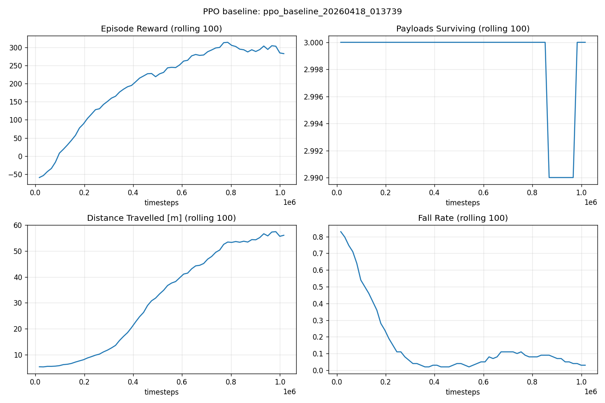

# PPO Baseline & Difficulty Validation Report

**Date:** 2026-04-18
**Environment:** `MugheadWalker-v0` (defaults: `num_payloads=3`, `payload_mass_ratio=0.06`, `terrain_difficulty=0`, `obstacles=False`, `external_force=0.0`, `payload_bounciness=0.15`)
**Algorithm:** Stable-Baselines3 PPO, default hyperparameters, MlpPolicy
**Vec env:** `SubprocVecEnv`, `n_envs=8`
**Timesteps:** 1,000,000
**Device:** CPU (Apple Silicon)
**Wall time:** 262 s (≈4.4 min)
**Seed:** 0
**Run dir:** `runs/ppo_baseline_20260418_013739/`

---

## 1. Evaluation Results (10 episodes, deterministic policy)

| Metric | Value |
| --- | --- |
| Mean episode reward | **261.9** (σ = 218.9) |
| Mean payloads surviving | **3.0 / 3** |
| Mean distance travelled | **57.0 m** |
| Success rate (no fall) | **40 %** (4/10) |

Per-episode breakdown:

| Ep | Reward | Payloads | Distance | Success |
|----|--------|----------|----------|---------|
| 0 | 511.8 | 3 | 88.7 | ✅ |
| 1 | 507.9 | 3 | 85.4 | ✅ |
| 2 |  60.4 | 3 | 30.7 | ✗ |
| 3 | 113.2 | 3 | 39.6 | ✗ |
| 4 | -45.4 | 3 | 13.7 | ✗ |
| 5 | 241.7 | 3 | 60.0 | ✗ |
| 6 | 515.9 | 3 | 88.7 | ✅ |
| 7 |   6.5 | 3 | 22.0 | ✗ |
| 8 | 515.0 | 3 | 88.7 | ✅ |
| 9 | 192.0 | 3 | 52.4 | ✗ |

## 2. Training Curves



Final rolling-100 values during training:

| Metric | Final value |
| --- | --- |
| ep_rew_mean | 282 |
| distance_mean | 56 m |
| payloads_remaining_mean | 3.0 |
| fall_rate | 0.03 |
| ep_len_mean | ≈1200 |

## 3. Difficulty Assessment

Spec §4.3 validation criteria:

| Criterion | Threshold | Observed | Verdict |
| --- | --- | --- | --- |
| Meaningful performance | mean reward > 50 | 261.9 | ✅ (greatly exceeded) |
| Payload preservation signal | mean ≥ 1/3 | 3.0/3 | ✅ (saturated) |
| Not trivially solved | — | 40 % success | mixed |

**Summary:** The default configuration is **too easy on payload preservation but non-trivial on locomotion stability**. PPO learns to keep all 3 payloads in 100 % of evaluation episodes. The remaining challenge is simply *walking reliably* — 60 % of eval episodes still end in a fall.

In other words: **payloads as currently configured do not meaningfully shape the competition.** The hull is wide enough and the payloads are light and low-bounce enough that incidentally-stable gaits preserve them for free.

## 4. Recommended Parameter Adjustments

To make payload preservation a real strategic axis — i.e., force a trade-off between speed and stability — we recommend making the cargo *active cargo* rather than inert ballast. Options below are roughly ordered from least to most disruptive.

1. **Increase `payload_mass_ratio` to 0.10–0.12.** Heavier cargo perturbs the hull's angular momentum more on each step, penalising jerky gaits. Still within the spec ceiling (3 × 0.12 = 36 % of hull mass, close to the "20 % total" intent but past it).
2. **Increase `payload_bounciness` to 0.30–0.40.** Bouncier payloads punish sudden vertical accelerations (stomping gaits). Easy to tune visually.
3. **Narrow the mug interior** (code change, not a config param) so payloads live closer to the rim. Currently the inside-cup check is a 70 × 31.5 rectangle — shrinking the width by 20 % would expose lateral-acceleration sloshing.
4. **Combine with `terrain_difficulty=1` (slopes) or `external_force` (wind).** These make locomotion itself harder, reducing the "free ride" the agent gets on flat ground.

For the competition, we suggest making these available as **round-level difficulty knobs** rather than redefining defaults.

## 5. Proposed Per-Round Parameter Sets (draft)

| Round | Theme | `num_payloads` | `payload_mass_ratio` | `payload_bounciness` | `terrain_difficulty` | `obstacles` | `external_force` |
| --- | --- | --- | --- | --- | --- | --- | --- |
| 1 | Warm-up (flat, light cargo) | 3 | 0.04 | 0.10 | 0 | False | 0.0 |
| 2 | Default | 3 | 0.06 | 0.15 | 0 | False | 0.0 |
| 3 | Heavy cargo | 3 | 0.10 | 0.20 | 0 | False | 0.0 |
| 4 | Bouncy cargo | 3 | 0.06 | 0.40 | 0 | False | 0.0 |
| 5 | Uneven ground | 3 | 0.06 | 0.15 | 1 | False | 0.0 |
| 6 | Finale (combo) | 3 | 0.10 | 0.30 | 1 | True | 0.3 |

> Note: `terrain_difficulty`, `obstacles`, and `external_force` are currently wired as configurable parameters but have no behavioural implementation yet — they will be added in a follow-up spec. Rounds 5–6 require that work to land first.

## 6. Reproduction

```bash
pip install -e .[rl]
python examples/train_ppo.py --timesteps 1000000 --n-envs 8 --tag ppo_baseline
python examples/evaluate.py --model runs/<run_dir>/model.zip --episodes 10 --out eval.json
python examples/plot_curves.py runs/<run_dir>
```

TensorBoard:
```bash
tensorboard --logdir runs/<run_dir>/tb
```
