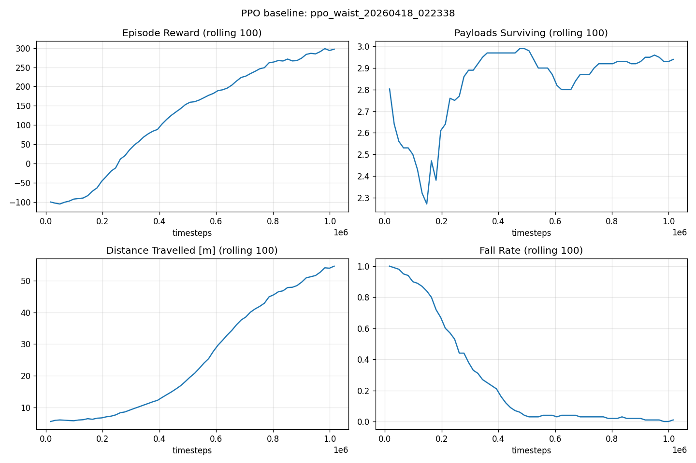

# PPO Baseline & Difficulty Validation Report

**Latest update:** 2026-04-18 (waist-joint env)
**Environment:** `MugheadWalker-v0` (defaults: `num_payloads=3`, `payload_mass_ratio=0.06`, `mug_inner_width=50.0`, `terrain_difficulty=0`, `obstacles=False`, `external_force=0.0`, `payload_bounciness=0.15`)
**Algorithm:** Stable-Baselines3 PPO, default hyperparameters, MlpPolicy
**Vec env:** `SubprocVecEnv`, `n_envs=8`
**Timesteps:** 1,000,000
**Device:** CPU (Apple Silicon)
**Seed:** 0

---

## 1. Before / After (waist-joint refactor)

The environment was refactored on 2026-04-18 per [`docs/superpowers/specs/2026-04-18-waist-joint-design.md`](../superpowers/specs/2026-04-18-waist-joint-design.md): the single hull was split into a **chassis** + **mug** connected by a motorized revolute **waist joint**, and `MUG_INNER_WIDTH` was narrowed from 70 → 50. Goal: make payload preservation a meaningful strategic axis.

| Metric | v0 (single hull, wide cup) | v1 (waist joint, narrow cup) | Target |
| --- | --- | --- | --- |
| Mean episode reward | 261.9 (σ 218.9) | **337.2 (σ 97.8)** | > 50 |
| Mean payloads surviving | 3.0 / 3 | **3.0 / 3** | ≈ 2 / 3 |
| Mean distance travelled | 57.0 m | **62.9 m** | — |
| Success rate (no fall) | 40 % | **70 %** | — |
| Wall time (1 M steps) | 262 s | 284 s | — |

**Unexpected result:** narrowing the cup and adding a waist did **not** make payload preservation harder. PPO learned to use the waist joint to actively stabilise the mug, which simultaneously improved locomotion stability — success rate rose from 40 % to 70 %, and payload survival remained saturated at 3.0 / 3.

Per spec §9, this places the new env in the **"still too easy"** regime (> 2.5 payloads surviving). Recommended follow-up: tighten further (`mug_inner_width` 50 → 45, `payload_mass_ratio` 0.06 → 0.08, or `payload_bounciness` 0.15 → 0.25).

## 2. Evaluation Results — v1 waist-joint env (10 episodes, deterministic)

| Metric | Value |
| --- | --- |
| Mean episode reward | **337.2** (σ = 97.8) |
| Mean payloads surviving | **3.0 / 3** |
| Mean distance travelled | **62.9 m** |
| Success rate (no fall) | **70 %** (7/10) |

Per-episode breakdown:

| Ep | Reward | Payloads | Distance | Success |
|----|--------|----------|----------|---------|
| 0 | 395.9 | 3 | 66.2 | ✅ |
| 1 | 394.8 | 3 | 66.9 | ✅ |
| 2 | 395.2 | 3 | 66.5 | ✅ |
| 3 | 390.5 | 3 | 65.6 | ✅ |
| 4 | 128.9 | 3 | 42.9 | ✗ |
| 5 | 194.8 | 3 | 51.5 | ✗ |
| 6 | 408.9 | 3 | 69.4 | ✅ |
| 7 | 398.6 | 3 | 67.4 | ✅ |
| 8 | 403.0 | 3 | 68.3 | ✅ |
| 9 | 261.5 | 3 | 64.3 | ✗ |

Run dir: `runs/ppo_waist_20260418_022338/`

## 3. Training Curves — v1



Final rolling-100 values during training:

| Metric | Final value |
| --- | --- |
| ep_rew_mean | 297 |
| distance_mean | 54.5 m |
| payloads_remaining_mean | 2.94 |
| fall_rate | 0.01 |
| ep_len_mean | ≈1500 |

## 4. Difficulty Assessment — v1

Spec §9 validation criteria:

| Criterion | Threshold | Observed | Verdict |
| --- | --- | --- | --- |
| Meaningful performance | mean reward > 50 | 337.2 | ✅ (greatly exceeded) |
| Payload preservation signal | payload survival ∈ [1.5, 2.5] | 3.0 / 3 | ❌ (still too easy) |
| Locomotion stability | — | 70 % success | ✅ (improved from 40 %) |

**Summary:** The waist-joint refactor made the walker **better at everything**, not harder at payload management specifically. PPO discovered that active waist control both (a) keeps the mug level against lateral cargo sloshing and (b) provides an auxiliary torque for body pitch control. Payloads continue to ride safely in the cup.

**Silver lining:** the waist joint is still a valuable addition — it unlocks a richer action space and makes the physics look less "ragdoll". But for difficulty calibration, we need a follow-up change.

## 5. Recommended Follow-up (v2 candidate knobs)

Order from least to most disruptive:

1. **`mug_inner_width=45`** (down from 50, 10 % tighter). Already a supported kwarg — no code change.
2. **`payload_mass_ratio=0.08`** (up from 0.06). Heavier cargo perturbs both chassis and mug. Already supported.
3. **`payload_bounciness=0.25`** (up from 0.15). Bouncier payloads punish jerky gaits. Already supported.
4. **Combine 1+2** for Round 3–4 difficulty.
5. **`terrain_difficulty=1`** (needs implementation) for Round 5.

Recommended next step: re-run 1 M PPO with `mug_inner_width=45` as a quick retest. If that still sits at 3.0 / 3, stack with `payload_mass_ratio=0.08`.

## 6. Proposed Per-Round Parameter Sets (draft, updated)

| Round | Theme | `mug_inner_width` | `payload_mass_ratio` | `payload_bounciness` | `terrain_difficulty` | `obstacles` | `external_force` |
| --- | --- | --- | --- | --- | --- | --- | --- |
| 1 | Warm-up | 60 | 0.04 | 0.10 | 0 | False | 0.0 |
| 2 | Default | 50 | 0.06 | 0.15 | 0 | False | 0.0 |
| 3 | Narrow cup | 45 | 0.06 | 0.15 | 0 | False | 0.0 |
| 4 | Heavy + bouncy | 50 | 0.08 | 0.30 | 0 | False | 0.0 |
| 5 | Uneven ground | 50 | 0.06 | 0.15 | 1 | False | 0.0 |
| 6 | Finale (combo) | 45 | 0.08 | 0.25 | 1 | True | 0.3 |

> `terrain_difficulty`, `obstacles`, `external_force` are wired as kwargs but behaviourally inert; Rounds 5–6 need a follow-up spec to land first.

## 7. Reproduction

```bash
pip install -e .[rl]
python examples/train_ppo.py --timesteps 1000000 --n-envs 8 --tag ppo_waist
python examples/evaluate.py --model runs/<run_dir>/model.zip --episodes 10 --out eval.json
python examples/plot_curves.py runs/<run_dir>
```

TensorBoard:
```bash
tensorboard --logdir runs/<run_dir>/tb
```

---

## Appendix A — v0 (pre-waist) baseline, 2026-04-18

Kept for historical comparison. This configuration is no longer the default env.

**Env:** `MugheadWalker-v0` with single-hull `MUG_INNER_WIDTH=70`, no waist joint, 40-dim obs, 4-dim action.
**Run dir:** `runs/ppo_baseline_20260418_013739/`
**Wall time:** 262 s

| Metric | Value |
| --- | --- |
| Mean episode reward | 261.9 (σ = 218.9) |
| Mean payloads surviving | 3.0 / 3 |
| Mean distance travelled | 57.0 m |
| Success rate (no fall) | 40 % |

See `docs/baseline/ppo_baseline_curves.png` for v0 curves. Pre-waist difficulty assessment concluded that payload preservation was too easy and the hull fell too often — which motivated the waist-joint refactor documented above.
